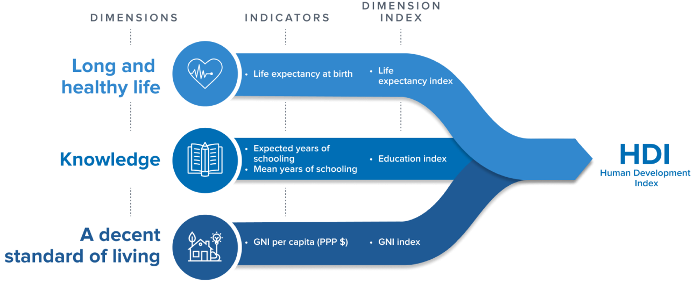

---
jupyter:
  jupytext:
    formats: ipynb,Rmd
    notebook_metadata_filter: all,-language_info
    split_at_heading: true
    text_representation:
      extension: .Rmd
      format_name: rmarkdown
      format_version: '1.2'
      jupytext_version: 1.17.2
  kernelspec:
    display_name: Python 3 (ipykernel)
    language: python
    name: python3
---

# Pandas from Numpy

This tutorial will show the fundamental structure of Pandas Data Frames. We will look at the components that constitute a Data Frame - for instance, Numpy arrays - in order to gain a deeper understanding of the raw ingredients that more advanced Pandas methods and functions operate on.

## What is Pandas?

Pandas is an open-source python library for data manipulation and analysis.

::: {note}

**Why is Pandas called Pandas?**

The “Pandas” name is short for “panel data”. The library was named after the
type of econometrics panel data that it was designed to analyse. [Panel
data](https://en.wikipedia.org/wiki/Panel_data) are longitudinal data where
the same observational units (e.g. countries) are observed over multiple
instances across time.

:::

The Pandas Data Frame is the most important feature of the Pandas library. Data Frames, as the name suggests, contain not only the data for an analysis, but a toolkit of methods for cleaning, plotting and interacting with the data in flexible ways. For more information about Pandas see [this page](https://Pandas.pydata.org/about/).

The standard way to make a new Data Frame is to ask Pandas to read a data file
(like a `.csv` file) into a Data Frame. Before we do that however, we will
build our own Data Frame from scratch, beginning with the fundamental building
block for Data Frames: Numpy arrays.

```{python}
# Import the libraries needed for this page
import numpy as np
import pandas as pd
```


## Numpy arrays

Let's say we have some data that applies to a set of countries, and we have some countries in mind:

```{python}
country_names_array = np.array(['Australia', 'Brazil', 'Canada',
                                'China', 'Germany', 'Spain',
                                'France', 'United Kingdom', 'India',
                                'Italy', 'Japan', 'South Korea',
                                'Mexico', 'Russia', 'United States'])
country_names_array
```

For compactness, we'll also want to use the corresponding [standard
three-letter code](https://en.wikipedia.org/wiki/ISO_3166-1_alpha-3) for each
country, like so:

```{python}
country_codes_array = np.array(['AUS', 'BRA', 'CAN',
                                'CHN', 'DEU', 'ESP',
                                'FRA', 'GBR', 'IND',
                                'ITA', 'JPN', 'KOR',
                                'MEX', 'RUS', 'USA'])
country_codes_array
```

For each of these countries, we have a Human Development Index (HDI) score. The
HDI score for a country is a summary over multiple dimensions of human
development: life expectancy, average years of schooling and Gross National
Income per capita. 



([Image credit](https://hdr.undp.org/data-center/human-development-index#/indices/HDI))

```{python}
# Human Development Index Scores for each country
hdis_array = np.array([0.896, 0.668, 0.89,
                       0.586, 0.89,  0.828,
                       0.844, 0.863, 0.49,
                       0.842, 0.883, 0.824,
                       0.709, 0.733, 0.894])
hdis_array
```

By the way, these data are real; they come from statistics compiled by the
United Nations. For simplicity, we are only looking at data from the year
2000.  See the [datasets and licenses page](data/data_notes) for more detail.

Let's say we also have the fertility rate for each country.  The fertility
rate is the average number of children born to to each woman. In due course,
we're interested to see whether HDI can predict the fertility rate values.

```{python}
# Fertility rate scores for each country
fert_rates_array = np.array([1.764, 2.247, 1.51,
                             1.628, 1.386, 1.21,
                             1.876, 1.641, 3.35,
                             1.249, 1.346, 1.467,
                             2.714, 1.19 , 2.03 ])
fert_rates_array
```

As experienced data analysts, we first want to inspect this relationship
graphically, for example with the [Matplotlib
library](https://matplotlib.org). Later, we will see that Pandas offers us
some streamlined ways of plotting data, without the need to import other
libraries.

```{python}
# Some basic plotting with Matplotlib.
import matplotlib.pyplot as plt

plt.scatter(hdis_array, fert_rates_array)
plt.xlabel('Human Development Index')
plt.ylabel('Fertility Rate');
```

## Pandas Series (aka an array + an index)

(Aka is an [abbreviation for "Also Known
As"](https://writingexplained.org/aka-or-aka).)

We want a good way to keep it clear which value corresponds to each country.
We're going to start with the HDI values.

One way of doing that is to make a new data structure that contains the HDI values, but also has *labels* for each value.  Pandas has an object for that, called a `Series`.  You can construct a Series by passing the values and the labels:

```{python}
# Make a Series from the `hdis_array`
hdi_series =  pd.Series(hdis_array, index=country_codes_array)
hdi_series
```

Notice the `index=` named argument.  Pandas calls the collection of labels for
each value - the *Index*.  Think of the Index as you would an index for
a book.  As the index in a book gives you the page number corresponding to
particular word, the Pandas Index of a Series is a way of finding the element
(value) corresponding to a particular country code.

We can get to the collection of labels with
the `.index` attribute of the Series.


```{python}
# Show the index of `hdi_series`
hdi_series.index
```

`hdi_series` also contains the HDI values, accessible with the `.values`
attribute:

```{python}
# Show the values (data) in `hdi_series`
hdi_series.values
```

Think of the Series as an object that associates an array of values
(`.values`) with the corresponding labels for each value (`.index`).

We can access values from their corresponding label, by using the `.loc`
accessor, an attribute of the Series object.

```{python}
# Using label based indexing to view a specific value.
hdi_series.loc['MEX']
```

`.loc` is an accessor that allows us to pass labels (that are present in the
`.index`), and that returns the corresponding value(s).  Here we ask for more
than one value, by passing in a list of labels:

```{python}
# Using label based indexing to view two specific values.
hdi_series.loc[['KOR', 'USA']]
```

Notice above, that passing one label to `.loc` returns the value, but passing
two or more labels to `.loc` returns a subset of the Series.   Put another
way, one label gives a value, but more than one label gives a Series.

Indexing with `.loc` is called *label-based indexing*.  You can also index by
position, as you would with a Numpy array.  Let's remind ourselves of basic
indexing in Numpy; to get the thirteenth value in the *Numpy array* of HDI
values, one could run:

```{python}
# Using integer-based indexing to retrieve a specific value from an *array*.
hdis_array[12]
```

Numpy indexing with integers, like the above, is always indexing *by
position*. We count from 0, so position 12 contains the thirteenth element.

You can do the same type of indexing with a Pandas series, with the `.iloc`
accessor.  Think of `.iloc` as *integer* indexing, or, if you like, `loc`ating
with `i`ntegers.

```{python}
# Get the 13th element with `iloc` indexing.
hdi_series.iloc[12]
```

```{python}
# Get the 12th and 15th element with `.iloc` indexing.
hdi_series.iloc[[11, 14]]
```

Notice again that one integer to `.iloc` gives a value, but two or more
integers gives a Series.

You can already imagine that this kind of label-based indexing could be
useful, because it is easier to avoid mistakes with:

```{python}
hdi_series.loc['MEX']
```

than it is to work out the position of Mexico in the array of values, and then
do:

```{python}
hdis_array[11]  # Was Mexico really at position 11?
```

— oh, whoops, we mean:

```{python}
hdis_array[12]  # Ouch, no, it was at position 12.
```

As well as being harder to make mistakes, it makes the code easier to read,
and therefore, easier to debug.

But the real value from this idea comes when you have more than one Series
with corresponding labels.

For example, we can also make a Series with the fertility rate (`fert_rate`)
data, like this:

```{python}
# Make a series of the fertility rates
fert_rate_series = pd.Series(fert_rates_array, index=country_codes_array)
fert_rate_series
```

But now imagine we want to look at the corresponding `HDI` and `fert_rate`
values.  We can do this separately, for each Series, like this:

```{python}
# Label-based indexing
fert_rate_series.loc['MEX']
```

```{python}
# Label-based indexing
hdi_series.loc['MEX']
```

(pd-data-frame-intro)=
## Pandas Data Frames (aka dictionary-like collection of series)

Imagine though, that we're going to be doing this for multiple countries, and
that we have multiple (not just two) values per country.  We would like a way
of putting these Series together into something like a table, where the rows
have labels (just as the Series values do), and the columns have names.

Each Series corresponds to one column in this table.  Pandas calls these
tables *Data Frames*.

```{python}
# Creating a DataFrame from a dictionary
df = pd.DataFrame({'Human Development Index': hdi_series,
                   'Fertility Rate': fert_rate_series})
df
```

Think of the Data Frame as being like a dictionary of Series.

* The keys in this dictionary are the column names we provided: `Human
  Development Index` and `Fertility Rate`.
* The values are the corresponding Series.

Notice that the Data Frame, like the Series, has an Index:

```{python}
# The Index of the Data Frame.
df.index
```

Pandas created the Data Frame Index by looking at the Index of each of the
Series from which we built the Data Frame.

In this case, the Series had the same values in their Indices, so the Index
for the Data Frame is the same as the Index for the each and both Series:


::: {exercise-start}
:label: differing-indices
:class: dropdown
:::

Perhaps your agile mind is racing ahead, wondering what Pandas would do if the
two Series had different Indices.

As an experiment, imagine now we have another Series that has a slightly
different Index.  Let's say for example, that we have taken the original
`fert_rate_series`, and sorted it in reverse alphabetical order by Index
value.  Here is the Pandas code to do that:

```{python}
# Sort fert_rate_series in reverse alphabetical order by Code.
fert_rate_reversed = fert_rate_series.sort_index(ascending=False)
fert_rate_reversed
```

Now imagine we create a new Data Frame with the original `hdi` Series and `fert_rate_reversed`:

```{python}
# Creating a new DataFrame from a dictionary, with one Series reversed.
df2 = pd.DataFrame({'Human Development Index': hdi_series,
                    'Fertility Rate': fert_rate_reversed})
```

What would you expect to see if you display `df2`?  Have a think, then uncomment the cell below to display the value of `df2`:

```{python}
# df2
```

Why do you think you see this outcome?

To test your theory, consider a new Data Frame where we specify the reversed
Series first in the dictionary:

```{python}
# New DataFrame from a dictionary, reversed Series first.
df3 = pd.DataFrame({'Fertility Rate': fert_rate_reversed,
                    'Human Development Index': hdi_series})
```

Yes, the columns will be in the opposite order, `Fertility Rate` first, then `Human Development Index` second.  But what order will the rows be in (what will the Index order be)?

Reflect, then try running the cell below after removing the `# `:

```{python}
# df3
```

Was your theory right?  If not, what is your new theory?

Now consider this:

```{python}
# New DataFrame from a dictionary, reversed Series first.
hdi_reversed = hdi_series.sort_index(ascending=False)
hdi_reversed
```

```{python}
df4 = pd.DataFrame({'Fertility Rate': fert_rate_reversed,
                    'Human Development Index': hdi_reversed})
```

What does your new theory predict about the new `df4`?  Consider, then have a look.

```{python}
# df4
```

Maybe your theory does fit, maybe it does not.  If it does not, what is your
new theory?  To test further, consider what would happen here:

```{python}
# Scramble the row order a bit.
row_order = [0, 1, 2] + [14, 13, 12, 11, 10, 9, 8, 7, 6, 5, 4, 3]
fert_scrambled = fert_rate_series.iloc[row_order]
fert_scrambled
```

```{python}
df5 = pd.DataFrame({'Fertility Rate': fert_scrambled,
                    'Human Development Index': hdi_reversed})
```

```{python}
# df5
```

After these examples, what is your final working theory about the algorithm
Pandas uses to match the Indices of Series, when creating Data Frames?

::: {exercise-end}
:::

::: {solution-start} differing-indices
:class: dropdown
:::

Here's our hypothesis of the algorithm:

* First check if the Series Indices are the same.  If so, use the Index of any
  Series.
* If they are not the same, first sort all Series by their Index values, and
  use the resulting sorted Index.

What was your hypothesis?  If it was different from ours, why do you think yours fits the results better?  What tests would you do to test your theory against our theory?

::: {solution-end}
:::

## Selecting columns from a Data Frame

We can get the `Human Development Index` (`hdi`) Series by name, by using *direct indexing* into the Data Frame, like this:

```{python}
# Getting the Human Development Index series by name
hdi_from_df = df['Human Development Index']
hdi_from_df
```

(direct-indirect)=
::: {note}

**Direct and indirect indexing**

We use the term *direct indexing* to mean indexing without going through an
accessor.  Direct indexing therefore, is where the opening square bracket
follows the Data Frame or Series value, as in: `df['Human Development
Index']`.  There is no accessor method between the Data Frame value `df` and
the opening square bracket.  It is a detail for our purposes, but this means
it is the `df.__getitem__` method that handles the indexing request.

By contrast, *indirect indexing* is where we index into the Data Frame or
Series object via an *accessor method* such as `loc` and `iloc`.  In this
case, the square bracket follows the accessor method name, rather than the
object itself.  Thus `df.iloc[0]` (see below) is indirect indexing, using the
`iloc` accessor. Again, this is a detail, but indirect indexing with e.g.
`iloc` means it is the (e.g.) `df.iloc.__getitem__` method that handles the
indexing request.

In general, in Pandas, the behavior of direct indexing can differ from that of
indirect indexing with `.loc` or `.iloc`, particularly direct indexing of Data
Frames.  As a general rule, it is wise to prefer indirect indexing with `.loc`
and `.iloc` unless you are confident about the behavior of direct indexing.

You'll notice that we restrict ourselves to using direct indexing on Data
Frames (not Series), and when we do use direct indexing, we use it in two
specific situations, for which is it very easy to reason about the results:

* Selection of columns by column name;
* Selection of rows with Boolean Series.

More on this later.

:::

Remember that a Data Frame is a dictionary-like collection of Series.

The `Human Development Index` column is now a Series contained inside the `df`
Data Frame.

We have fetched that embedded Series by using *direct indexing*.  We place the
column name (`'Human Development Index'`) between square brackets following
the data frame value, so `'Human Development Index'` specified what we want to
select from the Data Frame.  We get back a new Series, extracted from the Data Frame:

```{python}
# Show the type of `hdi_from_df`
type(hdi_from_df)
```

(series-names)=
## What's in a name?

You can see in the output display that the extracted Series now has an extra
attribute, which is the `name`.

```{python}
# Show the extracted Series again.  Notice the Name.
hdi_from_df
```

We said above that Series are the association between an array of `.values`,
and a corresponding collection of labels, in `.index`.  Now we see that the
Series also has a `.name`, that we had not set in our original series:

```{python}
# The `name` attribute of the Series we've extracted from the Data Frame.
hdi_from_df.name
```

Above, when we first built the series of HDI values and labels with
`pd.Series`, we not set the name of the Series, so it got the default `.name`
of `None`.  We rebuild it here:

```{python}
# We rebuild with pd.Series.
hdi_series =  pd.Series(hdis_array, index=country_codes_array)
# When we don't specify the name, the default is None.
hdi_series.name is None
```

It can be useful to set the `.name` attribute can be useful for remind you of
the nature of the data in the `.values` array.

Let's make a new Series — called `hdi_series_named` — where we **do** specify
a `.name` attribute when calling the `pd.Series()` constructor.

```{python}
# Make a series from the `hdis` array, specifying the `name` attribute.
hdi_series_named = pd.Series(hdis_array,
                             index=country_codes_array,
                             name='HDI')
# Show the `name` attribute.
hdi_series_named.name
```

You can set the name on an existing Series using the `.name` attribute:

```{python}
hdi_series_named.name = 'Hum Dev Ind'
hdi_series_named
```

## Indirect indexing into Data Frames

Indirect indexing occurs when we use the `.loc` and `.iloc` accessor methods
on the Data Frame, to get rows by label (index value) or by position:

```{python}
# Using `.loc` indirect indexing on the Data Frame.
df.loc['MEX']
```

Notice what Pandas did here.  As for `.loc` indexing into Series, `.loc`
indexing into the Data Frame *with a single label* returns the *contents* of
the row.   And Pandas, being a general thinker, sees that the contents of the
row are values, that have labels, where the labels are the column names.  Thus
it returns the row to you as a new Series, where the Series has values from
the row values, and labels from the column names.

Indexing with more than one value returns a subset of the Data Frame.  In
strict parallel to indexing into a Series, indexing with multiple values into
a Data Frame, returns a subset of the Data Frame, which is itself, a Data
Frame.

```{python}
# Using `.loc` with index labels
df.loc[['KOR', 'USA']]
```

(what-is-a-series)=
## What is a Series?  What is a Data Frame?

A *Series* is the association of:

* An array of values (`.values`)
* A sequence of labels for each value (`.index`)
* A name (which can be `None`).

A *Data Frame* is a dictionary-like collection of Series.

For a Series, the `.index` has labels corresponding to the *values*.

For a Data Frame, the `.index` has labels corresponding the *rows*.


## Adding more columns to the Data Frame

We have more data to add to our Data Frame. Let's add those data as new
columns, and then compare the result with the Data Frame we get from loading
a data file containing the same data.

First, we make another Numpy array, containing the full name of each country.

```{python}
# Making an array containing the name of each country
country_names_array = np.array(['Australia', 'Brazil', 'Canada',
                                'China', 'Germany', 'Spain',
                                'France', 'United Kingdom', 'India',
                                'Italy', 'Japan', 'South Korea',
                                'Mexico', 'Russia', 'United States'])
country_names_array
```

Now, we get the population of each country, in millions.

```{python}
# The population of each country in millions, in the year 2000.
population_array = np.array([  19.1324, 174.0182,   30.8918,
                             1269.5811,  81.7972,   41.0197,
                               59.4837,  59.0573, 1057.9227,
                               57.2722, 127.0278,   46.7666,
                               98.6255, 146.7177,  281.4841])
population_array
```

We are about to *put* a new Series into the Data Frame.

Remember that we can fetch the Series corresponding to a particular column like this:

```{python}
# Getting the Human Development Index Series by name
hdi_from_df = df['Human Development Index']
hdi_from_df
```

Here we are *indexing* (in fact *direct indexing*) into the Data Frame `df`, on the right-hand-side (RHS) of the ` = ` to fetch the corresponding Series.

We can *put* data in a new or existing column in the Data Frame by using
direct indexing on the left-hand-side of the assignment, like this:

```{python}
# Add the array as a column in the DataFrame.
df['Population'] = population_array
df
```

This assignment says "take the values in `population_array` and make a new
column (Series) named `'Population'` in the Data Frame".

Remember the maxim that "a Data Frame is just a dictionary-like collection of
Series"?

Our new `Population` column has now become a Series inside the `df` Data
Frame, where the `.values` of that Series are the values from `population_array`.

We can fetch that new `'Population'` Series from the Data Frame by direct
indexing, as we did above for the `'Human Development Index'` column / Series.

```{python}
# Fetch Series named 'Population' using direct indexing into the DataFrame.
pop_from_df = df['Population']
pop_from_df
```

The `.name` of the Series is the name of the column from which it was fetched:

```{python}
# Show the .name attribute of the new Series inside the Data Frame.
pop_from_df.name
```

The `values` of the new Series are the ones we put in in the assignment above:

```{python}
# Show the array containing the data for the new Series.
pop_from_df.values
```

Notice that the extracted `pop_from_df` Series has an Index, and the Index is
the same as the Index of the Data Frame.  In other words, in extracting the
`'Population'` Series, the Series has inherited the Index from the Data Frame.

We could have used the `pd.Series()` constructor to build the same Series, built from its components:

```{python}
# We can build a similar Series to the one we fetched like this.
population_series = pd.Series(population_array,
                              index=country_codes_array,
                              name='Population')
population_series
```

Let's use the same `df['Name'] = array` syntax to add a final column to our Data Frame, containing the full country names:

```{python}
# Adding in the country names
df['Country Name'] = country_names_array
```

Here is our full Data Frame - built from its component ingredients - in its
resplendent glory:

```{python}
# View the full DataFrame.
df
```

## Comparing the built and loaded Data Frames

This page built a Data Frame from scratch from Numpy components, to deepen our
understanding of what a Data Frame is made from.

The cell below shows a more typical method of making a Data Frame, that is
asking Pandas to create a new Data Frame by loading data from a file. We use
the `pd.read_csv()` function to read some data from a `.csv` file:

```{python}
# Import data from a csv file
loaded_df = pd.read_csv("data/year_2000_hdi_fert.csv")
loaded_df
```

You'll notice that currently, the index of the Data Frame we just loaded is
a sequence of numbers. This is the Index that Pandas creates by default, unless
you give it some other information on what the Index should be.  We'll look
more at this default Index on the [next page](0_1_to_loc_or_iloc).

We can use the `.set_index()` method of the Data Frame to take the column
containing the three-letter country codes and set it to be the row labels of
the Data Frame (the Index).  We will look more at Pandas methods in later
pages.

Here we tell `.set_index()` the column name to use as the `.index`
- in this case we use the `'Code'` column, containing the country codes:

```{python}
# Set the new Data Frame to have values from the "Code" column as labels.
loaded_labeled_df = loaded_df.set_index('Code')
loaded_labeled_df
```

Let's compare this loaded Data Frame to the Data Frame we built from Numpy
components.

```{python}
# The Data Frame we built from its component parts.
df
```

The `loaded_labeled_df` Data Frame was built automatically by Pandas, when
loading in a `.csv` file using `pd.read_csv()`.

We built the `df` Data Frame from Numpy arrays and strings.

Both Data Frames contain the same data, and the same labels.  In fact, we can
use the `.equals` method of Data Frames to ask Pandas whether it agrees the
Data Frames are equivalent:

```{python}
df.equals(loaded_labeled_df)
```

They are equivalent.

::: {exercise-start}
:label: index-in-display
:class: dropdown
:::

In fact the `df` and `loaded_labeled_df` data frames are not exactly the same.
If you look very carefully at the notebook output for the two data frames, you
may be able to spot the difference.  Pandas `.equals` does not care about this
difference, but let's imagine we did.  Try to work out how to change the `df`
Data Frame to give *exactly* the same display as we see for
`loaded_labeled_df`.


::: {exercise-end}
:::

::: {solution-start} index-in-display
:class: dropdown
:::

You probably spotted that the `loaded_labeled_df` displays a `name` for the Index.  You can also see this displaying the `.index` on its own:

```{python}
loaded_labeled_df.index
```

compared to:

```{python}
df.index
```

We see that the `.name` attribute differs for the two Indices; to make the Data Frame displays match, we should set the `.name` on the `df` Data Frame.

The simplest way to do that is:

```{python}
# Make a copy of the `df` Data Frame. This step is unnecessary to solving
# the problem, it is just to be neat.
df_copy = df.copy()
```

```{python}
# Set the Index name.
df_copy.index.name = 'Code'
df_copy
```

::: {solution-end}
:::

## Convenient Plotting with Data Frames

Remember earlier we imported Matplotlib to plot some of our data?

Now we have a Data Frame, we can use the Data Frame's in-built plotting
machinery, to make the same graph. To do this, we can use the `.plot()`
method of the Data Frame, and specify the name of a column to plot on the `x`
axis, and a name of a column to plot on the `y` axis. We use the `kind=`
argument to tell Pandas what type of plot we want (in this case a scatter
plot).

```{python}
# Plotting with Pandas methods.
df.plot(x='Human Development Index',
        y='Fertility Rate',
        kind='scatter');
```

In fact the Pandas `.plot` methods wrap Matplotlib, so the output from using
Matplotlib directly (see towards the top of this page) will look very similar
to the output from using Pandas `.plot`, but Pandas can, among other things, use column names to make better default axis labels.
