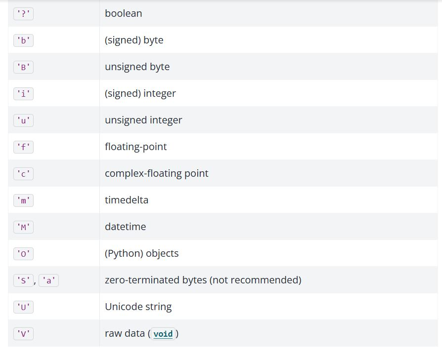
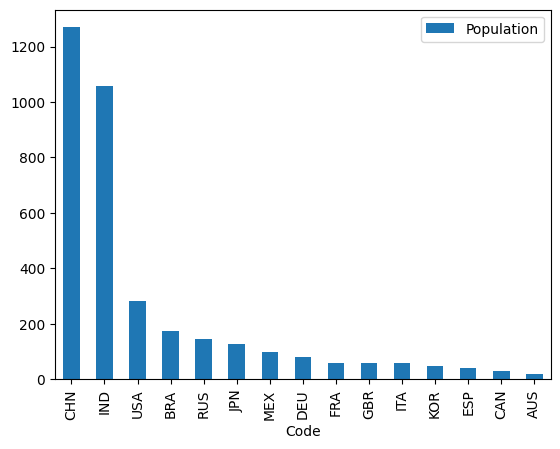

---
jupyter:
  jupytext:
    formats: ipynb,Rmd
    text_representation:
      extension: .Rmd
      format_name: rmarkdown
      format_version: '1.2'
      jupytext_version: 1.17.2
  kernelspec:
    display_name: Python 3 (ipykernel)
    language: python
    name: python3
---

# Attributes and Methods of Series and Data Frames

<!---
📝 NOTE-  Covered here:

Columns in a dataframe  can be of different dtypes
* Operations are on columns by default (describe, sum, min, max)
* attributes of df (shape, dtypes columns, index)
* methods of df (unique, describe, counts, value_counts, min, max, std, sort_values, sort_index)

Structure of page:

* show all relevant methods/attributes of numpy arrays

* reinforce that "Series = array + index + name". Then show relevant methods/attributes of Series.

* reinforce that "DataFrame = dictionary-like collection of Series". Then show all relevant methods/attributes of DataFrames.
-->

On the [previous](0_0_pandas_intro.Rmd) [pages](0_1_to_loc_or_iloc.Rmd) we
have seen how Pandas Series are constructed by combining Numpy arrays (the
`.values` attribute of a Series) with other attributes (a `.name` string and
array-like `.index`). We then examined how Pandas Data Frames are built from
a collection of Series, in a dictionary-like structure.

This page will dive deeper into the machinery behind Series and Data Frames.
Once we have constructed our Series or Data Frame, Pandas provides many useful
methods for cleaning, aggregating, plotting and (subsequently) analysing our
data.

We will begin by showing that Pandas Series and Data Frames have many methods that parallel those of Numpy arrays, though the methods are adapted to work in the context of Pandas objects.


## More Pandas from Numpy

Let's examine some of the methods we can use on numpy arrays.

Remember, a *method* is a function attached to an object. 

In this case, our object is a Numpy array (later it will be a Pandas Series or Data Frame).

We'll build a Numpy array using the `np.array([])` constructor, containing our
familiar three-letter country codes. As before, you can see the [datasets and
licenses page](data/data_notes) for more detail.

```{python}
# Import libraries
import numpy as np
import pandas as pd

# Our own routine to giving hints to the exercises.
from hint import hint_1, hint_2
```

We build the constituent arrays:

```{python}
# Standard three-letter code for each country
country_codes_array = np.array(['AUS', 'BRA', 'CAN',
                                'CHN', 'DEU', 'ESP',
                                'FRA', 'GBR', 'IND',
                                'ITA', 'JPN', 'KOR',
                                'MEX', 'RUS', 'USA'])
```

```{python}
# Human Development Index Scores for each country
hdis_array = np.array([0.896, 0.668, 0.89,
                       0.586, 0.89,  0.828,
                       0.844, 0.863, 0.49,
                       0.842, 0.883, 0.824,
                       0.709, 0.733, 0.894])
```

```{python}
# Full names of each country.
country_names_array = np.array(['Australia', 'Brazil', 'Canada',
                                'China', 'Germany', 'Spain',
                                'France', 'United Kingdom', 'India',
                                'Italy', 'Japan', 'South Korea',
                                'Mexico', 'Russia', 'United States'])
```

When dealing with any object in python, it can be useful to use the in-built
python `dir()` function. This returns the *names* of every attribute and
method that we can access/call from the object:

```{python}
# Show all available attributes/methods
dir(hdis_array)
```

For now we will ignore the elements in the printout that contain `__`.  These
double underscores are called "dunders" (short for double underscores);
attributes and methods starting and ending with `__` are often called *dunder
attributes* and *dunder methods*.  Python uses the dunder naming scheme as
a convention to indicate that these methods and attributes are part of the
internal machinery of an object.

Another Python naming convention uses an underscore `_` at the start of
a method or attribute name to indicate that the method or attribute is
*private* — that is, the attribute / method is for the object to use, but for
us — the user of the object — to avoid.

Ignoring the all attributes and methods that begin with underscores, we can
see a large number of attributes and methods that we can access from this or
any other Numpy array.

```{python}
# Attributes and methods not starting with `_` (or `__`):
[k for k in dir(hdis_array) if not k.startswith('_')]
```

One of these `array` attributes is `shape`. We often want to know the `shape` of our data, as it tells us the number of elements along each dimension (axis) of the array:

```{python}
# Shape
hdis_array.shape
```

We can read this output as "15 elements in a single dimension". By contrast,
let's look at an array with more than one dimension:

```{python}
# Arrays with more dimensions
zeros_array = np.zeros([2, 2])
zeros_array
```

This 2D array has the following shape:

```{python}
# Arrays with more dimensions
zeros_array.shape
```

We an read this as "2 rows and 2 columns" (which equates to 4 elements), or "two elements along the first dimension, two elements along the second".

If we want to count the number of individual elements in an array (across all dimensions) we can use the `.size` attribute:

```{python}
# How many elements in the (15, ) `hdi` array?
hdis_array.size
```

```{python}
# How many elements in the (2, 2) `zeros_array`?
zeros_array.size
```

`len()` as applied to Numpy arrays gives us the number of elements of the *first dimension* (axis) only.

```{python}
len(zeros_array)
```

```{python}
len(hdis_array)
```

::: {note}

**How does `len()` work?**

Calling the standard Python function `len()` on an object `obj` causes Python to call the `__len__()` method of the object.  Therefore, the result of `len(obj)` is the same as that for `obj.__len__()`.

Each object type can define what `len(obj)` means by implementing a `__len__`
method.  For Numpy arrays `arr.__len__()` gives you the equivalent of
`arr.shape[0]`.

Later we will see that Data Frames have their own implementation of `__len__`.

:::


We also often want to know the type of data in our array, as it will affect the analyses we can perform. Are we dealing with numbers or text, for instance? 

To access this information, we can view the `dtype` attribute. 

Let's look at the `dtype` for the `country_codes` array:

```{python}
# Dtype
country_codes_array.dtype
```

The `dtype` attribute here is just telling us that this is string data. For an explanation of the meaning, see the image below.




Let's look at the `dtype` of the `hdis_array`:

```{python}
# Dtype (again)
hdis_array.dtype
```

For this array, the `dtype` tells us that we are dealing with numerical data - specifically float data represented with 64 bits of memory per element.


### Statistical Attributes of Numpy arrays

Numpy also provides a variety of what we can call "statistical attributes" which tell us statistics about the data inside the array.

::: {note}

**What is a statistic?**

A statistic is some number or sequence of numbers that summarizes a distribution of values.  For example, the mean or average is a measure of the center of the distribution.  Similarly the min and max are the values on the extreme left and extreme right of a distribution.

:::

As with the methods we looked at in the previous section, Pandas has its own versions of many of these methods, as we will see later in the page.

Let's again look at the `hdis_array`, which contains the HDI score of each country. 

```{python}
hdis_array
```

There are a variety of useful statistical methods for arrays:

```{python}
# Minimum value in entire array.
hdis_array.min()
```

```{python}
# Maximum value in entire array.
hdis_array.max()
```

```{python}
# Mean of all values in array.
hdis_array.mean()
```

```{python}
# Standard deviation.
hdis_array.std()
```

## Pandas Series attributes and methods

Remember our answer to [What is a Series?](what-is-a-series):

> A *Series* is the association of:
>
> * An array of values (`.values`)
> * A sequence of labels for each value (`.index`)
> * A name (which can be `None`).

Because Series have arrays as their underlying model for storing values, it is
not surprising that we can use many of the same methods we have just seen for
Numpy arrays on Pandas Series.

Let's make a series from the HDI scores, called `hdi_series`. We do this using the now familiar `pd.Series()` constructor. Again, we will use the `country_codes` array as an index:

```{python}
# Show again from Series, then show for df below
hdi_series =  pd.Series(hdis_array,
                        index=country_codes_array)
hdi_series
```

As we know, we can view the `index`, `name` and `values` attributes of the Series using the familiar accessors:

```{python}
# The `index` component of the Series
hdi_series.index
```

```{python}
# The `name` component (currently is None)
hdi_series.name is None
```

```{python}
# The numpy array (aka `.values`) component of the Series
hdi_series.values
```

Let's verify that we can use methods that parallel the Numpy methods we saw above. Predictably, these methods operate on the Numpy array component of the series (e.g. the `.values` attribute). 

First, let's look at the `shape`, `size` and `dtype`:

```{python}
# Show the `shape` of the `hdi_series`
hdi_series.shape
```

```{python}
# Show the `size` of the `hdi_series`
hdi_series.size
```

```{python}
# Show the `dtype` of the `hdi_series`
hdi_series.dtype
```

Because a Series is a Numpy array (of `.values`) plus some additional
attributes/methods, these methods work on the Series in a very similar manner
to their equivalents on Numpy arrays.

This also applies to statistical methods. Let's get the `.min()` and `.max()` values from the `hdi_series`.

```{python}
# Min
hdi_series.min()
```

```{python}
# Max
hdi_series.max()
```

These operations return the same values as when we call the method directly on the `hdis_array` (unsurprising, as each object contains the same data)!:

```{python}
# Get the `max()` value from the `hdis_array`, for comparison
hdis_array.max()
```

Ok, so these methods are available with names that are familiar from Numpy.
However, Pandas also introduces some additional methods.  You may want to
compare the output of `dir()` for the `hdis_array` vs the `hdi_series` to see
the overlap/differences - as the printout is messy, we will not show it again
here.

One very useful Series method is `.describe()`. This will give us a variety of
statistics about the data in the `.values` array of the Series:

```{python}
# Use the `.describe()` on the `hdi_series`
hdi_series.describe()
```

Neat, an easy summary of the number of observations, the mean, the standard deviation around the mean, and then the range/interquartile range.

Conversely, the `.value_counts()` method will count the occurrence of each *unique* value in the Series:

```{python}
# Use the `value_counts()` method
hdi_series.value_counts()
```

These methods can also be applied to arrays containing categorical/string
data:

```{python}
# Constructing a Series containing categorical data
country_names_series = pd.Series(country_names_array,
                                 index=country_codes_array)
country_names_series
```

```{python}
# Using .describe()
country_names_series.describe()
```

Helpfully, Pandas has adjusted the `.describe()` summary in light of the
`values` array of the `country_names_series` containing categorical/string
data.

We now see summaries of the number of values, number of unique values etc,
rather than numerical statistics like the mean and standard deviation.

The `.value_counts()` method behaves the same as with numerical data, as both
numbers and strings can be unique in an array.  For our case, the output isn't very interesting, as all the country names are unique.

```{python}
country_names_series.value_counts()
```

If we want to see the *unique* values only, regardless of the number of times
each value occurs, we can use the `.unique()` method.  This gives us an array
of the unique values.

```{python}
# Show the unique values in the Series
hdi_series.unique()
```

```{python}
# Show the unique values in the Series
country_names_series.unique()
```

```{python}
# But of course, all the country names are unique, so the
# above is the same, in our case, as:
country_names_series.values
```


## Pandas Data Frame attributes

Now, remember again our other maxim that *A *Data Frame* is a dictionary-like collection of Series.*

Because of this, we can use all the methods we have seen so far on any Data Frame column. Each column is a Series, and therefore contains a Numpy array as its `.values` attribute.

However, Data Frames have some (useful!) extra methods (including statistical methods) not available for Series.

First, let's import the [HDI/fertility rate data](https://ourworldindata.org/grapher/children-per-woman-vs-human-development-index):

```{python}
# Import our dataset
df = pd.read_csv("data/year_2000_hdi_fert.csv")
df
```

We can use `dir()` on this Data Frame, to view all of the available
attributes and methods (that don't begin with `_`):

```{python}
# Show all available operations on the dataframe
[k for k in dir(df) if not k.startswith('_')]
```

If you peruse the list you'll notice that some of the methods have the sames as methods that apply to both Numpy arrays and Series. For instance, we can retrieve the `.shape` of the entire Data Frame.  This gives us the number of rows and the number of columns.

```{python}
# Get the shape attribute (n_rows, n_columns)
df.shape
```

(len-df)=
`len(df)` (therefore, `df.__len__()`) gives the number of rows.  This
corresponds to the Numpy behavior of giving the number of elements on the
first dimension of the array:

```{python}
# Length of Data Frame is number of rows.
len(df)
```

We can also pull out an individual Series/column and view the `.shape` of that specific Series:

```{python}
# View the `shape` of a specific column
df['Fertility Rate'].shape
```

When accessed for the entire Data Frame, the `size` attribute works in the same way as we have seen for Numpy arrays and Pandas Series e.g. it will tell us the total number of *elements* in the entire Data Frame (e.g. the number of elements in the rows multiplied by the number of elements in the columns):

```{python}
# Show the `size` of the Data Frame
df.size
```

::: {exercise-start}
:label: attributes-series
:class: dropdown
:::

Your job here is to make a new Series which summarises aspects of the `df` Data Frame. In the `.values` array, your Series should contain the values of the `.shape` and `.size` attributes of `df`. It should also contain the `dtype` of the `index` of `df` (therefore, telling your user whether the `index` contains numeric labels, `str` labels, or something else). See if you can figure out how to get Pandas to report this via indexing (e.g. rather than copy pasting the information from the output of `df.index`).

The `index` of your Series should clearly state what each `value` is. E.g. the strings `shape`, `size`, `index_dtype` should be the `index` labels in your Series. 

The `name` attribute of your Series should be`df_attributes`.

When displayed, your Series should look like this:

```
shape          (15, 4)
size                60
index_dtype     object
Name: df_attributes, dtype: object
```

Try to create this Series in as few lines of code as possible. 

You may run into an error with the `shape` attribute. Try running `hint_1()` for a hint on how to solve this.

You can also run `hint_2()` to get a hint on how to get Pandas to report the `dtype` of the `index`.

**Try to use the hints as a last resort, however...**

```{python}
# Your code here
```

::: {exercise-end}
:::

::: {solution-start} attributes-series
:class: dropdown
:::
            
Our solution to this is below. First, we create an array containing the attributes. We must use the `str()` function to convert the output of `df.shape` to a single dimension (a `str` with 7 characters, rather than a `(2, )` tuple). This is in order to make its shape match that of `df.size` and the `index.dtype` string. Otherwise we get a nasty error when passing the array to the `pd.Series()` constructor, because we are trying to make a `.values` array using values with incompatible dimensions. 

We got the `dtype` of the `index` labels by accessing the `dtype` attribute of the `index`, in a chained operation e.g.: `df.index.dtype`.

We set the `index` and the `name` when we call the as optional arguments within `pd.Series()` (you may have done this using `df.index = ` and `df.name =`, which is another valid approach):

```{python}
# Make an array containing the desired attributes - note the use of `str()`
attributes_array = np.array([str(df.shape),
                             df.size,
                             df.index.dtype])

# Convert to Series, specify `index` and `name`
df_attributes = pd.Series(attributes_array,
                          index = ['shape', 'size', "index_dtype"],
                          name = "df_attributes" )
# Show the Series
df_attributes
```

Creating your own Series in this way (perhaps performed by a custom function) can be useful for displaying bespoke summaries of a dataset/Data Frame. However, normally this would be done with more complicated statistical information, not just the `shape`/`size`/`dtype`!


::: {solution-end}
:::


Once we've done these preliminary inspections and we know how many observations we have, in any data analysis context, we will always want to know what variables we have in the Data Frame columns, and (again) what type of data is in each.

The `.columns` attribute will tell us the name (label) for each column:

```{python}
# Show the column names
df.columns
```

...and we can use the `.dtypes` attribute to inspect the type of data in each column:

```{python}
# Show the dtype in each column
df.dtypes
```

The `object` data type means that the column contains either mixed data or string data (in this case string data). The numeric data in this Data Frame is represented as a 64-bit float (`float64`).

Now we know how much data we have, and what type of data it is. Currently, if
we want to access a specific row of the Data Frame (remember, each row here is
one country), we will have to index either by position, or by using the labels from the default `RangeIndex`. We did not
specify an index when we loaded in the Data Frame, so, as we learned
previously, Pandas will automatically supply one:

```{python}
# Show the index (representing the integers 0 through 14)
df.index
```

We have [already discussed](0_1_to_loc_or_iloc.Rmd) the downsides of using the default (integer) index. As we have seen before, we can use the `.set_index()` method to choose a column containing values which we will use as index labels. We have come across Data Frame methods previously (`.sort_values()`) and will look at more in the next section. For now, just remember that *methods* differ from data *attributes* in that they are a *function attached to an object* rather than just a value attached to an object. Methods often do something to or with the data rather than just report a value or set of values, like an attribute does.

Let's set the `Code` column (containing the three-letter country codes) to be our index labels:

```{python}
# Set the index as country name
df = df.set_index("Code")
df
```

As expected, when we now view the `index` attribute, we see that the country codes are the values that populate the index:

```{python}
# Show that the index is now country names
df.index
```

...and we can use the now familiar (and less error-prone) label-based indexing with strings to retrieve specific rows:

```{python}
# Remember what having the codes in the index lets us do
df.loc[['USA', 'ITA']]
```

## Pandas Data Frame methods

The `.sort_values()` method we used on the [previous page](0_1_to_loc_or_iloc.Rmd) and the `set_index()` method we just used in the last section are just some of the many methods attached to Pandas Data Frames. We saw that many Numpy array methods have parallel versions that apply to Pandas Series and this principle also applies to Data Frames, built as they are from Pandas Series.


Many Data Frame methods will report information from the Data Frame *as a whole*, rather than just for a given column/Series.

For instance, remember the `.describe()` method for a Series.  Here we pull out a column from the Data Frame with direct indexing, and then call `.describe()` on that Series.

```{python}
# Pull the HDI column out of the Data Frame with direct indexing.
hdi_from_df = df['Human Development Index']
# The result is a Series, on which we can call the Series
# `.describe()` method.
hdi_from_df.describe()
```

We can also call the `.describe()` method on the whole Data Frame. The same useful statistical summary is shown for every column when we use the method on the whole Data Frame:

```{python}
# Describe numerical variables
df.describe()
```

We can also use direct indexing to `describe` a specific subset of columns:

```{python}
# For categorical variables
# Define columns we want to select.
cols = ['Fertility Rate', 'Human Development Index']
# Select columns by direct indexing, then describe.
df[cols].describe()
```
::: {exercise-start}
:label: by-any-means
:class: dropdown
:::

Write code you need to create a Series that contains the just the means of the `Human Development Index`, `Fertility Rate` and `Population` variables. For good measure, let's also require that the `name` attribute is set to `mean`. The output should look like this:

```
Human Development Index      0.789333
Fertility Rate               1.773867
Population                 236.719867
Name: mean, dtype: float64
```

Try to do this in as few lines of code as possible, using the methods shown on this page...

```{python}
# Your code here
```

::: {exercise-end}
:::

::: {solution-start} by-any-means
:class: dropdown
:::

The output of the `.describe()` method is itself a Data Frame, and the `index` of this Data Frame contains a row called `mean`, which, shockingly, contains the means. As a result, you can use `.loc` indexing to retrieve just the means from the output of `.describe()`:

```{python}
# Solution
df.describe().loc['mean']
```

Another option is to manually drop the column containing non-numeric data, and then use the `.mean()` method, and manually specify the `name` attribute:

```{python}
mean_series = df.drop(columns='Country Name').mean()
mean_series.name = "mean"
mean_series
```

A further solution (much less elegent) is to calculate the means manually, store them in an array or list, then using the `pd.Series()` constructor with `name = mean` and `index = ['Human Development Index', 'Fertility Rate', 'Population']`:

```{python}
# Calculate the means
mean_hdi = df['Human Development Index'].mean()
mean_fert = df['Fertility Rate'].mean()
mean_pop = df['Population'].mean()

# An array of the means
means_arr = np.array([mean_hdi, mean_fert, mean_pop])

# Create a Series
means_series = pd.Series(means_arr, 
                         name="means",
                         index= ['Human Development Index',
                                 'Fertility Rate', 'Population'])

means_series
```

Phew! That really was inefficient. Many Pandas methods are designed to save us time in situations exactly like this...

In fact, Pandas is a particularly good example of a complex library where there are many ways of achieving the same result, and where AI or careless StackOverflow searches can give you a very inefficient or inelegant solution.   We strongly advise you to keep investing the time to work out the most elegant solution to your Pandas problems, in order to keep learning, and so that you write code that others can read, including you, the maintainer.

::: {solution-end}
:::

Because each Data Frame column is just a Pandas Series, all of the Series methods we saw above can be used on individual Series:

```{python}
# Mean of Series extracted from a Data Frame.
df['Fertility Rate'].mean()
```

By contrast, other methods, like `.sort_values()` take a column name as an argument, but have effects on the entire Data Frame.

For instance, if we want to sort *rows of the whole Data Frame* by `Human Development Index` scores:

```{python}
# Sort values by HDI, lowest value first (sort ascending).
df_by_hdi = df.sort_values('Human Development Index')
df_by_hdi
```

```{python}
# Sort values by HDI, highest value first (sort descending).
df_by_hdi_reversed = df.sort_values('Human Development Index',
                                    ascending=False)
df_by_hdi_reversed
```

We can also sort the Data Frame rows by the values in the index, using `.sort_index()`.  By default this sorts the Index values from lowest to highest.  Because the Index in our case has `str` values, this sorts the Index in alphabetical order, so `df.sort_index()` will arrange the rows of the Data Frame in alphabetical order according to the Index values:

```{python}
# Sort index (in alphabetical order)
df_by_hdi_reversed.sort_index()
```

```{python}
# Sort index (reverse alphabetical order)
df_rev_ind = df_by_hdi_reversed.sort_index(ascending=False)
df_rev_ind
```

Another useful method that can be powerful in tandem with label-based indexing, is `.drop()`. This lets us specify rows, using index labels, that we want to remove from the Data Frame. For instance, if we want to remove the data for Australia we can use:

```{python}
# Drop the 'USA' row
df_rev_ind.drop(index='USA')
```

If you compare this to the output from the last cell you will see that, as if by magic, the row for `USA` has disappeared.

In addition to removing data from the Dataframe, we will also often want to replace data. Maybe we want to recode categorical data with better labels, create custom dummy/indicator variables, or correct errors etc.

We can replace values using the descriptively named `.replace()` method. Lets say we want to use the abbreviation `UK` instead of `United Kingdom` in the `Country Name` column. We just give `.replace()` the value we want to replace, followed by the value we want to replace it with:

```{python}
# The `.replace()` method applied to a Series (in a Data Frame).
df['Country Name'].replace("United Kingdom", "UK")
```

Sure enough, `United Kingdom` has been replaced with `UK` in the Series in the output of the cell above. We can also do this with [collections of values](https://pandas.pydata.org/docs/reference/api/pandas.DataFrame.replace.html) (e.g. using a `dict` or `list` etc) rather than just single values, should we feel moved to do so.

By default, `.replace()` only replaces values that are equal to the first (target) argument to `.replace`.

For instance, we might expect the following code to replace `United` in both `United Kingdom` and `United States`, but we would be wrong:

```{python}
# Not what we want.
df['Country Name'].replace("United", "Disunited")
```

This did not work because `.replace()` is searching for an element of the
Series which *equals* `United`, not that *contains* `United`. (There is an
alternative string-specific `.replace()` method, which behaves differently as
we will see on a [later page](0_6_more_pandas_methods_strings)).

We can achieve the desired result using the `regex` (standing for "regular expression") argument:

```{python}
# Allowing replace on a partial match.
df['Country Name'].replace("United", "Disunited", regex=True)
```

With `regex=True`, the `.replace()` method has searched for matches *within* other strings. So, `United` has been replaced in both `United Kingdom` and `United States`, despite not matching either string in full.

The `.replace` method can also be used for Series with numeric `dtype`s. For instance, some particularly patriotic data analyst might want to do the following replacement:

```{python}
# The Replace method, with numeric data.
df['Human Development Index'].replace(0.894, 100000)
```

### Methods for getting subsets of data from a Data Frame

Another common operation we may want to perform is to view only the start (e.g. the `.head`) or the end (e.g. the `.tail`) of a Data Frame. For instance, if the rows are organized by time, amongst many other reasons.

We could just use `.iloc` position-based indexing to do this. For example, to view the first three rows of the Data Frame we can use:

```{python}
# View the first three rows of the Data Frame, using `.iloc`
df.iloc[:3]
```

Or, alternatively, to view the last three rows:

```{python}
# View the last three rows of the Data Frame, using `.iloc`
df.iloc[-3:]
```

However, the kind folks at Pandas, because these operations are so common, have provided us the `.head()` and `.tail()` methods to do the same thing, with less typing and better readability.

`.head()` without arguments gives us the first five rows, equivalent to `.iloc[5]`.

```{python}
# Default .head() gives first five rows.
# Equivalent to `df.iloc[:5]
df.head()
```

We can pass an integer to the `.head()` method to specify the number of rows from the start of the Data Frame which we want to view.

```{python}
# Specify number of rows to .head().
# Equivalent to `df.iloc[:3]
df.head(3)
```

```{python}
# View the first three rows of the Data Frame, using `.head()`
df.head(3)
```

We can also do the same thing at the other end of the Data Frame, using the `.tail()` method:

```{python}
# By default, `.tail()` gives the last five rows of the Data Frame.
# Equivalent to `df.iloc[-5:]
df.tail()
```

```{python}
# Specify the number of rows counting from the last.
df.tail(3)
```

In addition to retrieving rows from the extremes of the Data Frame, we may also, for many different purposes, want to retrieve a *random* set of rows.

We can do this using the `.sample()` method. The syntax here is just the same as for `.head()` and `.tail()`, only now we are specifying the *number of random rows* we want to grab from the Data Frame.

For instance, if let's say we want to get three random rows, without replacement (so that we can't get the same row twice):

```{python}
# Grab three rows at random using `.sample()`
df.sample(n=3)
```

Even using the small dataset we have here, the overwhelming probability is that we will get a different selection of rows each time we run this command:

```{python}
# Grab three rows at random AGAIN using `.sample()`
df.sample(n=3)
```

If you are running this tutorial interactively, re-run the cell above a few times to see randomness in action...


Check the documentation for `.sample` by uncommenting the cell below, and running the cell (e.g. with Shift-Return):

```{python}
# Show documentation with (uncomment below and run):
# df.sample?
```

Notice that by default the sampling is *without replacement*, so once a row has been pulled into the output sample, it cannot be selected again for the remaining values in the sample.  When we deal out hands of cards from a standard 52-card deck., we are sampling from the pack without replacement, because any one card cannot be dealt more than once.

```{python}
# The first five rows.
first_five = df.head()
# Sample four values without replacement (the default).
first_five.sample(n=4)
```

Notice that no row appears twice in the sample.  Notice too that if we pass in an `n` of more than the number of rows, resampling without replacement has to fail, because it will run out of rows to sample from:

```{python tags=c("raises-exception")}
# Trying to take a without-replacement sample that is too large.
first_five.sample(n=10)
```

Conversely, if we specify with-replacement sampling, we can ask for as many values as we want.

```{python}
# Sampling 10 values from original 5, *with replacement*.
first_five.sample(n=10, replace=True)
```

We have so far specified the size of our sample with `n` — the number of rows
in the sample — but we can also specify the size as a fraction of the whole
Data Frame.  To get a sample that is half the size the original Data Frame
(`np.round(15 / 2) == 8`):

```{python}
# Take sample half the size of the original.
df.sample(frac=0.5)
```

::: {exercise-start}
:label: random-samples
:class: dropdown
:::

There are functions within Numpy (as well as other libraries) that shuffle/permute/randomize data within an array (or an arraylike object, such as a list).

Let's say we want to shuffle the *rows* in our Data Frame. We can do this with the `permutation()` function from the `numpy.random` submodule, but the output is very ugly. This operation brutally removes the nice Data Frame graphics (at least when run in a Jupyter notebook), and puts the rows of the Data Frame into a Numpy array, as shown below:

```{python}
# Effective but ugly
np.random.permutation(df)
```

Can you think of a way to perform this operation using only the Pandas methods we have seen so far on this page? In the cell below, you should write code which will:

- randomize the order of the *rows* in the Data Frame. The data in each row should be the same as before shuffling (e.g. the data for Russia should still be the data for Russia etc.)

- ensure that no rows are removed or duplicated, just shuffled

Try to find the solution in the cell below. Use as few lines of code as possible:

```{python}
# Your solution here
```

::: {exercise-end}
:::

::: {solution-start} random-samples
:class: dropdown
:::

The solution is to take a `.sample()` which is the same *size as the number of rows in the original dataframe*. We can do this easily by using `n = len(df)` as in the input for `df.sample()`:

```{python}
# A trick to shuffle the rows
df.sample(n=len(df))
```

Or, with greater grace, we can use `frac=1`, to mean "take a random sample of 100% of the rows", effectively permuting them:

```{python}
# A clean, efficient way to permute the rows
df.sample(frac=1)
```

If you look at the `index` of either Data Frame in the above ceels, you'll notice that the rows are now in a random order.

Because the sample is a random selection of the rows - and the default setting of `.sample()` is to sample *without replacement*  - using both `.sample(len(df))` and `df.sample(frac=1)` has the effect of randomizing the row order. All the original rows remaining in the sample, and there is no duplication of any rows.

This method is often used on individual columns to (most likely) remove any statistical relationships between the data in that column and other columns. For instance, for [permutation testing](https://matthew-brett.github.io/cfd2020/permutation/permutation_and_t_test.html).


::: {solution-end}
:::

::: {exercise-start}
:label: more-random
:class: dropdown
:::

We mentioned above that the default behaviour of the `.sample()` method is to sample *without replacement*. We also mentioned that you can use the `replace=` argument to sample *with* replacement.

To use a classic "drawing marbles from a bag" analogy, this means that when we randomly select a marble, we place it *back* in the bag (after recording it's identity/colour etc) before we randomly draw the next marble. This means the same marble can appear twice in the final sample. 

As mentioned above, if we draw a sample of rows *with replacement* from our Data Frame, then individual rows can appear more than once in the resultant sample. If we draw a sample with replacement which is *larger* than the original data, it will certainly contain duplicate rows:

```{python}
# A sample with replacement
df.sample(len(df) + 10, 
          replace=True) 
```

Quickly scan the `index` for duplicates, to see that it contains duplicates (as it must, in order to generate a sample of this size).

Your task is the following:

- take a random sample *with replacement* of all the rows in the Data Frame (e.g. your sample should have the *same number of rows* as the original Data Frame)

- use an appropriate method to calculate the means of `Human Development Index`, `Fertility Rate` and `Population`, from your random sample

- using Pandas methods and indexing operations, calculate the *difference* between the means of `Human Development Index`, `Fertility Rate` and `Population` in your sample vs the means for the same variables in the original data

- store your result in a Pandas Series (note: depending what methods you use, your result may automatically be stored in a Pandas Series)

The result should look something like this (though your differences will differ from the ones shown below, because of the randomness inherent in your sampling):

```
Human Development Index      0.074467
Fertility Rate              -0.182600
Population                -210.516580
Name: mean, dtype: float64
```

Try to do this in as few lines of code as possible.

```{python}
# Your code here
```

::: {exercise-end}
:::

::: {solution-start} more-random
:class: dropdown
:::

There are several ways you can achieve this, but one way of doing it in a single line of code is to *chain Pandas methods together*.

The left hand side of the subtraction operation in the cell below uses the `.describe()` method and `.loc` indexing to calculate the means of the original data.

The right hand side of the subtraction draws a sample (the same size as the number of rows in `df`) using `.sample()` with `replace=True`. It then uses `.describe()` to calculate the means of the numeric variables *in this random sample*, and then `.loc` to select just those means (as opposed to including the other information that `.describe()` reports, like standard deviations etc).

The result of this subtraction shows us the difference between the original means and the means of our *resample* (e.g. our random sample, drawn with replacement):

```{python}
# Show the difference in the means (original data vs resample)
df.describe().loc['mean'] - df.sample(len(df), replace=True).describe().loc['mean']
```

You can also perform the same process, less efficiently, spread over multiple lines of code. The way shown below is not the only possible way - perhaps you used the `.mean()` method individually on each column, for instance, and then manually constructed a `Series` to store the results (even less efficient!) . Alternatively, you might have used `.drop()` to remove non-numeric columns, and then used `.mean()` in parallel on the numeric columns, another valid approach:

```{python}
# Calculate the original means
original_means = df.describe().loc['mean']

# Generate a resample
resample = df.sample(len(df), 
                     replace=True)

# Calculate the resample means
resample_means = resample.describe().loc['mean']

# Calculate the difference in means
difference_in_means = original_means - resample_means

# Show the difference
difference_in_means
```

Similar kinds of *resampling procedure* are often used to generate [bootstrapped confidence intervals](https://nbviewer.org/github/pxr687/bootstrap_tutorial/blob/main/bootstrap.ipynb).

::: {solution-end}
:::

## Plotting Methods

The Data Frame plotting *methods* that we have seen on the previous pages also
apply to Series.

When working with a Series, it makes most sense most of the time to use the
`kind='hist'` argument to inspect the distribution of the data in that Series:

```{python}
hdi_series.plot(kind='hist');
```

Other kinds of plot require data specified both for the x- and y- axes, so can only be used with Data Frames:

```{python tags=c("raises-exception")}
# A ValueError from trying to scatter plot a Series
hdi_series.plot(kind='scatter')
```

```{python}
# Show a scatter plot on a Data Frame, specifying x- and y- axes.
df.plot(x='Human Development Index',
        y='Fertility Rate',
        kind='scatter');
```

## A note on numerical operations

Any numerical operations performed on the Data Frame *as a whole* will be default be performed on the `values` in the Series that make up each column.

So, if we want to do something like multiplying the entire Data Frame by a single number, this operation will be performed separately on each element of each Series in the Data Frame.

This might make sense for some Data Frames, but in our case, we have string data in one column, so applying the multiplication to values in the `str` Series will give us results we probably didn't want:

```{python}
# This probably won't make sense in our case.
df * 200
```

More sensibly, we will most likely want to perform numerical operations on specific columns. We may want to *standardize* the values relative to a mean of 0 and standard deviation of 1, for instance.

::: {note}

**Standard scores**

If we have a sequence of values, we can calculate corresponding scores for that sequence by first subtracting the mean of the sequence, and second, dividing the result by the standard deviation of the original sequence.

The result is the [standard score](https://en.wikipedia.org/wiki/Standard_score) of each element in the sequence.

The process of calculating standard scores can be called *standardization*.  Standard scores are sometimes called *z-scores*.

:::

Pandas methods can be used to perform this computation, and again, the operation will be performed on each element in the `values` array of the specific Series/column that we grab.

For instance, to subtract the mean value from every element in the `.values` array we can use:

```{python}
# Subtract the mean from every element in the Series
df['Population'] - df['Population'].mean()
```

We can perform the full z-score standardization using the code in the cell below. Note that `df['Population'].mean()` and `df['Population'].std()` both return single values. Each of these values is used in the same way on every element in the `Population` column:

```{python}
# Standardize the `Population` scores
df['Population_z'] = ((df['Population'] - df['Population'].mean())
                      / df['Population'].std())
df
```

Because this feature (numerical operations performed on each element) is shared across all Pandas Series, and we are using Pandas methods, we can write a function which will compute the z-scores for any column containing numerical data: 

```{python}
# Define a function to calculate standard scores for a numeric Series.
def get_standard(in_series):
    """ Returns Series with standard score of each element of `in_series`.
    """
    # Formula for standard score.
    return (in_series - in_series.mean()) / in_series.std()
```

```{python}
# test our function
get_standard(df['Human Development Index'])
```

Again, each numerical operation that the function performs has been performed on every element of the `.values` array of the Data Frame column `Human Development Index`.

Let's add these new standardized data to the Data Frame, and plot them using the now familiar `.plot()` method:

```{python}
# Add standard scores for HDI
df['HDI_z'] = get_standard(df['Human Development Index'])
df
```

```{python}
# Plot the standardized variables.
# Notice both range from negative to positive.
df.plot(kind='scatter',
        x='Population_z',
        y='HDI_z');
```

We can see from this procedure that we have two bivariate outliers, with respect to `Population` and `HDI`, at the bottom right of the scatter plot.

This dataset is small enough that we can see that these values correspond to India and China...

```{python}
# Inspect the `Population_z` column to identify the outliers
df['Population_z'].sort_values()
```

... but for a larger dataset we could find them using [Boolean filtering ](0_5_filtering_data_with_pandas).


::: {exercise-start}
:label: getting-barred
:class: dropdown
:::

If you use `.plot(kind="bar")` you will generate a bar plot (that is, a chart with bars representing counts for different categories).

Your task is to use indexing methods of your choice, restricting yourself to the Pandas methods shown on this page, to create a bar plot which has:

* the name of each country on the x-axis

...and...

* bars which show the population of the country on the y-axis. The bars should be ordered from highest population (left hand side of the graph) to lowest population (right hand side of the graph).

*Unless you enjoy cheating, do not use other plotting libraries!*. Your final result should look like this:



As ever, use as few lines as you can, while but keep your code readable.

```{python}
# Your code below
```

::: {exercise-end}
:::

::: {solution-start} getting-barred
:class: dropdown
:::

It is possible to create this plot in one line of code, again, by *chaining* Pandas methods together. First, we use direct indexing with the column names to select just those variables. 

Then we use `sort_values()` using the `by='Population'` and `ascending=False` arguments to ensure that the population counts are sorted in descending order.

We then chain `.plot(kind='bar')` on the end, and we get the desired plot:

```{python}
# Solution
df[['Country Name', 'Population']].sort_values(by='Population', ascending=False).plot(kind='bar')
```

*Food for thought*: what will happen if you reverse the order of `Country Name` and `Population` in the direct indexing operation? Do you think this will change the x-axis and and y-axis variables on the `.plot()`?

Have a think about what you think will happen; you can check by uncommenting the code below to see if you were correct:

```{python}
# df[['Population', 'Country Name',]].sort_values(by='Population', ascending=False).plot(kind='bar')
```

How would you explain the result?

::: {solution-end}
:::

## Summary

On this page we have further explored the idea that Pandas Data Frames, Pandas
Series and Numpy arrays have a nested structure.

Data Frames are *dictionary-like collections of Series*. Series are a combination of a Numpy array (`.values`) with other attributes (`name` and `index`). As a result, many methods we can use on a Series are similar to those available from Numpy arrays, and many Data Frame methods likewise parallel those from the Pandas Series that constitute the Data Frame.
